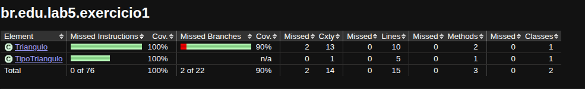
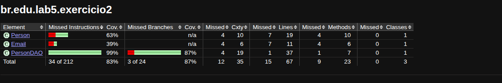
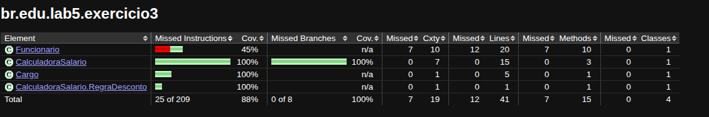

# lab-5-junit

Laboratório 5 — JUnit e TDD.

Projeto Java com **JUnit 5**, build via **Maven** e cobertura de código com **JaCoCo**.

## Estrutura

```
src/
├── main/java/br/edu/lab5/
│   ├── exercicio1/        # Triângulo (classificação)
│   ├── exercicio2/        # Person / Email / PersonDAO
│   └── exercicio3/        # CalculadoraSalario
└── test/java/br/edu/lab5/
    ├── exercicio1/TrianguloTest.java
    ├── exercicio2/PersonDAOTest.java
    └── exercicio3/CalculadoraSalarioTest.java
```

## Pré-requisitos

- JDK 17 ou superior
- Apache Maven 3.8+

Verifique com:

```bash
java -version
mvn -version
```

## Build

```bash
mvn clean compile
```

## Execução dos testes

Roda todos os testes dos três exercícios:

```bash
mvn test
```

Para rodar apenas os testes de um exercício:

```bash
mvn test -Dtest=TrianguloTest            # Exercício 1
mvn test -Dtest=PersonDAOTest            # Exercício 2
mvn test -Dtest=CalculadoraSalarioTest   # Exercício 3
```

## Cobertura de código (JaCoCo)

O plugin JaCoCo está configurado em [pom.xml](pom.xml) — ele gera o relatório automaticamente ao final da fase `test`:

```bash
mvn clean test
```

O relatório HTML fica em:

```
target/site/jacoco/index.html
```

Abra em um navegador para ver a cobertura por pacote, classe, método e linha.

Para reabrir o relatório:

```bash
xdg-open target/site/jacoco/index.html   # Linux
open target/site/jacoco/index.html       # macOS
```

---

## Exercício 1 — Triângulo

Classifica três lados inteiros como **EQUILÁTERO**, **ISÓSCELES**, **ESCALENO** ou **INVÁLIDO** (não satisfaz a desigualdade triangular, ou contém valor ≤ 0).

- Implementação: [Triangulo.java](src/main/java/br/edu/lab5/exercicio1/Triangulo.java) + [TipoTriangulo.java](src/main/java/br/edu/lab5/exercicio1/TipoTriangulo.java)
- Testes: [TrianguloTest.java](src/test/java/br/edu/lab5/exercicio1/TrianguloTest.java)

Casos cobertos:

| # | Cenário |
|---|---------|
| 1 | Escaleno válido (3,4,5) |
| 2 | Isósceles válido (5,5,3) |
| 3 | Equilátero válido (4,4,4) |
| 4-6 | Isósceles — 3 permutações (5,5,3) (5,3,5) (3,5,5) |
| 7 | Um valor zero |
| 8 | Um valor negativo |
| 9-11 | Soma de 2 lados = terceiro — 3 permutações (2,3,5) (2,5,3) (5,2,3) |
| 12-14 | Soma de 2 lados < terceiro — 3 permutações (1,2,10) (1,10,2) (10,1,2) |
| 15 | Três valores iguais a zero |

### Evidência de cobertura

> Substituir pelo screenshot após rodar `mvn clean test` localmente.
>
> Caminho do relatório: `target/site/jacoco/br.edu.lab5.exercicio1/index.html`
>
> 

---

## Exercício 2 — PersonDAO.isValidToInclude (TDD)

Implementado seguindo TDD. O método valida:

1. **Nome** composto por ao menos 2 partes, e apenas letras (Unicode — aceita acentos).
2. **Idade** no intervalo [1, 200].
3. **Person** deve ter ao menos um `Email` associado.
4. **Email.name** no formato `____@____.____` (cada parte com ao menos 1 caractere).

Retorna `List<String>` com todos os erros encontrados (vazia quando a `Person` é válida).

- Implementação: [PersonDAO.java](src/main/java/br/edu/lab5/exercicio2/PersonDAO.java) · [Person.java](src/main/java/br/edu/lab5/exercicio2/Person.java) · [Email.java](src/main/java/br/edu/lab5/exercicio2/Email.java)
- Testes: [PersonDAOTest.java](src/test/java/br/edu/lab5/exercicio2/PersonDAOTest.java)

### Evidência de cobertura

> 
>
> Caminho: `target/site/jacoco/br.edu.lab5.exercicio2/index.html`

---

## Exercício 3 — CalculadoraSalario (TDD)

Calcula o salário líquido de um `Funcionario` conforme regras por `Cargo`:

| Cargo         | Salário ≥ limite | Salário < limite | Limite |
|---------------|------------------|------------------|--------|
| DESENVOLVEDOR | 20% desconto     | 10% desconto     | 3.000,00 |
| DBA           | 25% desconto     | 15% desconto     | 2.000,00 |
| TESTADOR      | 25% desconto     | 15% desconto     | 2.000,00 |
| GERENTE       | 30% desconto     | 20% desconto     | 5.000,00 |

Usa `BigDecimal` com arredondamento `HALF_UP` (2 casas).

- Implementação: [CalculadoraSalario.java](src/main/java/br/edu/lab5/exercicio3/CalculadoraSalario.java) · [Funcionario.java](src/main/java/br/edu/lab5/exercicio3/Funcionario.java) · [Cargo.java](src/main/java/br/edu/lab5/exercicio3/Cargo.java)
- Testes: [CalculadoraSalarioTest.java](src/test/java/br/edu/lab5/exercicio3/CalculadoraSalarioTest.java)

### Evidência de cobertura

> 
>
> Caminho: `target/site/jacoco/br.edu.lab5.exercicio3/index.html`

---
